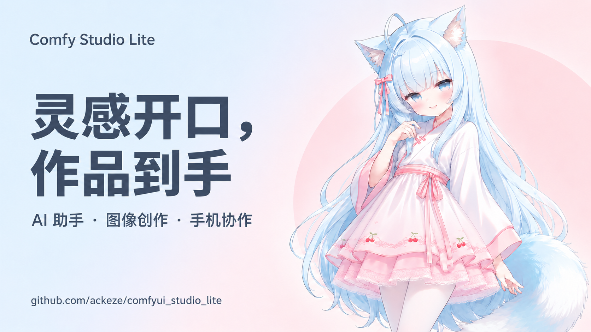
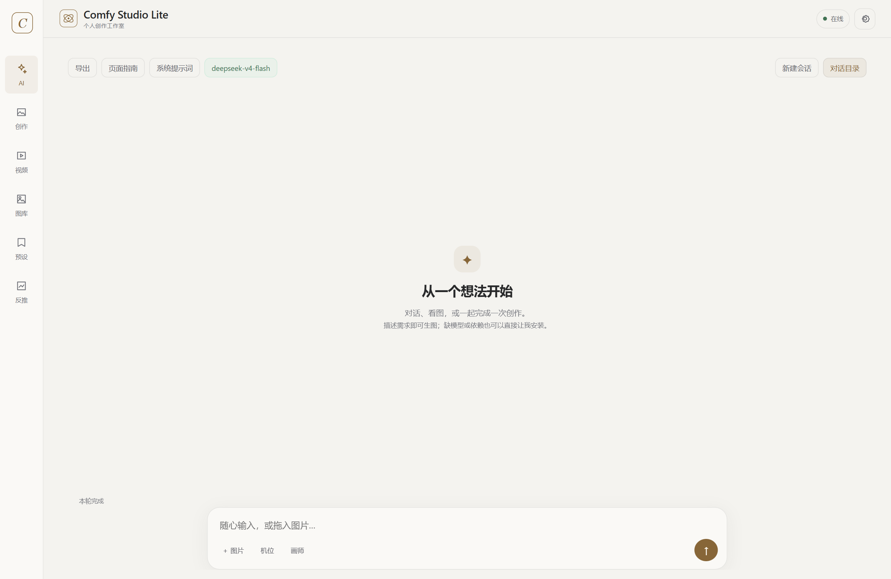
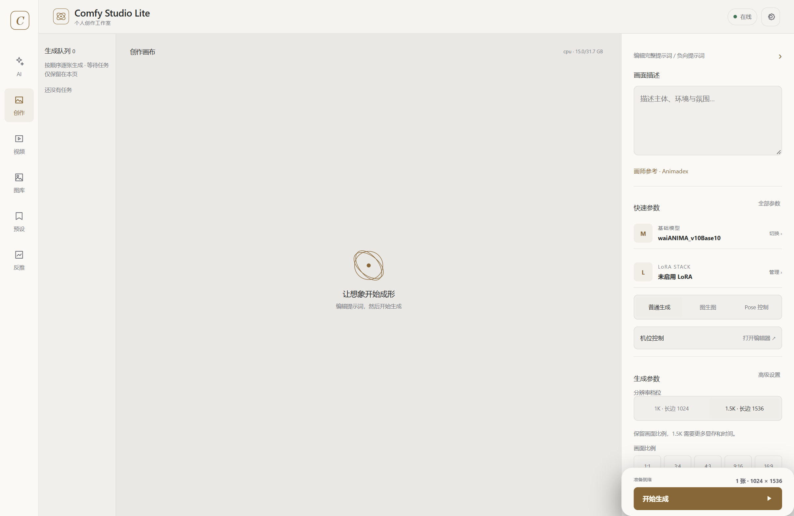
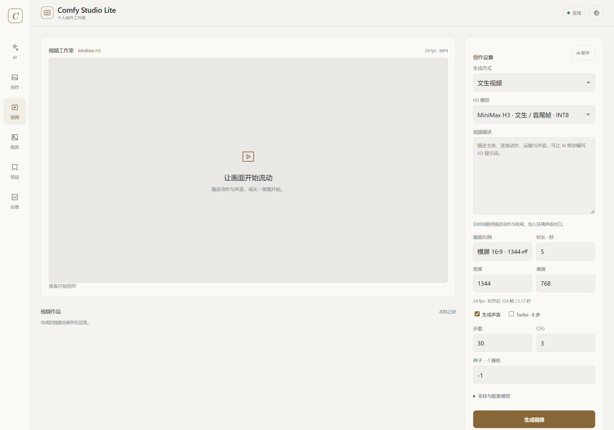
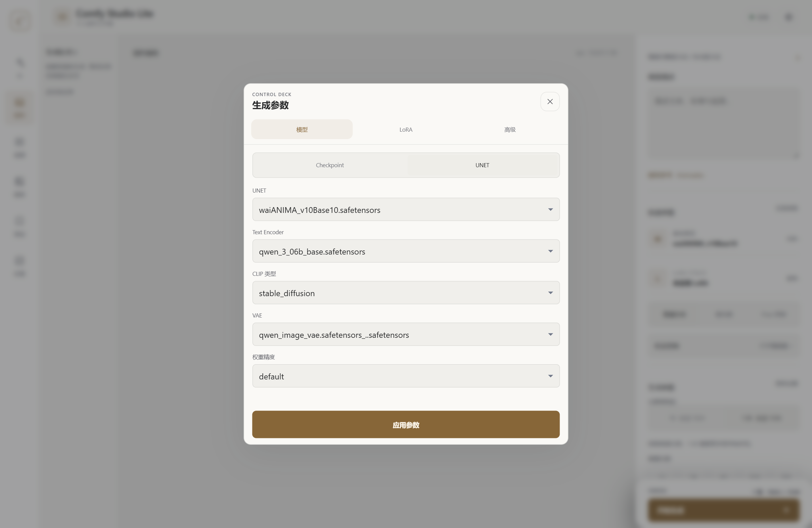
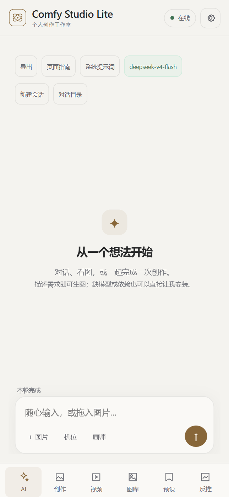
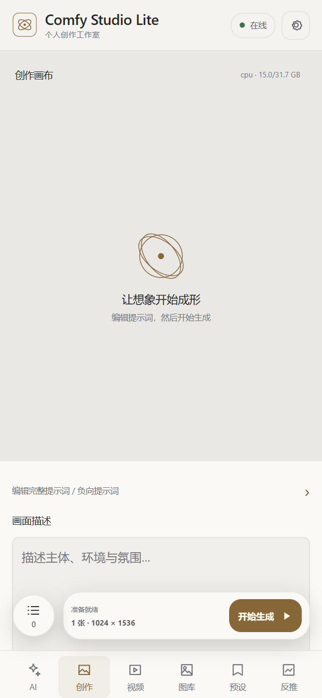

<h1 align="center">Comfy Studio Lite</h1>

<p align="center"><strong>灵感开口，作品到手。</strong></p>
<p align="center">用自然语言创作，在电脑与手机之间接续灵感。</p>

<p align="center">
  <a href="#快速开始"></a>
  <a href="https://github.com/ackeze/comfyui_studio_lite/releases/tag/v1.0"></a>
  <a href="LICENSE"></a>
</p>

<p align="center">
  <a href="#快速开始">快速开始</a> ·
  <a href="#界面预览">界面预览</a> ·
  <a href="#模型配置">模型配置</a> ·
  <a href="https://github.com/ackeze/comfyui_studio_lite/releases/download/v1.0/ComfyStudioLite-1.0.apk">下载 Android App</a> ·
  <a href="https://github.com/ackeze/comfyui_studio_lite/issues">反馈问题</a>
</p>



Comfy Studio Lite 是 ComfyUI 的轻量创作工作台。通过 AI 对话完成常用创作操作，也可以在编辑器中调整参数；电脑执行生成，同一局域网的手机连接工作台、查看任务和保存作品。

## 从需求到作品

| 功能 | 你可以做什么 |
| --- | --- |
| **AI 助手** | 图文对话、按需调用工具、提交图片与视频生成；复制、编辑、重试和创建对话分支。 |
| **图像创作** | 使用 Anima 与 waiANIMA 等模型，调整 LoRA、分辨率和采样参数，沿用编辑器设置生成。 |
| **视频工作台** | MiniMax H3 文生视频、首尾帧与参考图生成，设置动作、时长和声音，播放与下载 MP4。 |
| **手机协作** | 局域网连接电脑，提交任务、查看结果；Android App 通过系统保存窗口下载文件。 |
| **创作辅助** | 图片反推、作品图库和常用预设，便于整理提示词与复用配置。 |
| **资源维护** | 检查缺失的支持资源，确认后补齐模型与依赖；查看项目问题并审核文件修改差异。 |

## 界面预览

### AI 助手 · 从一个想法开始

默认进入 AI 页面。首次打开会逐页介绍各页面用途，可以跳过，也可以从「页面指南」重新查看。



### 创作工作台 · 参数在手边

独立画布、画面描述与生成参数，支持手动创作，也支持让 AI 沿用当前编辑器设置。



### 视频工作台 · 让画面开始流动

本地 MiniMax H3 模型，支持文生视频、首帧 / 尾帧 / 首尾帧，以及最多 4 张参考图。横屏、竖屏或自定义尺寸；24 fps，2–15 秒，界面显示对齐后的实际时长。



## 快速开始

需要 **ComfyUI 0.33.x+**、Python 3.10 及以上。安装依赖时请使用运行 ComfyUI 的 Python 环境。

**1. 安装插件**

在 ComfyUI 根目录打开终端：

```bat
cd custom_nodes
git clone https://github.com/ackeze/comfyui_studio_lite.git
cd comfyui_studio_lite
install.bat
```

也可以运行 `python install.py`。安装器扫描已有资源，只补齐缺失项；Hugging Face 失败时尝试 `hf-mirror.com`。

**2. 打开工作台**

重启 ComfyUI，访问 **http://127.0.0.1:8188/launcher**。插件自行提供前端。

**3. 配置 AI 服务**

打开 **设置 → AI 服务**，填写服务地址、API Key 和模型名称。看图需要使用支持图片与工具调用的模型，可单独指定「图片理解模型」。

**4. 开始创作**

可以直接对助手说：

> 帮我检查缺少哪些模型和依赖。
>
> 用 waiANIMA 生成一张浅蓝粉配色的动漫插画，背景简洁。
>
> 按当前编辑器设置生成一张图片。
>
> 帮我准备 MiniMax H3 的视频描述，再按视频编辑器设置生成。

助手按需求调用工具；资源下载和文件修改会先提供确认步骤。

<details>
<summary><strong>安装选项与资源清单</strong></summary>

```text
python install.py --required     只下载生图 UNET / CLIP / VAE
python install.py --dry-run      只检查，不下载
python install.py --skip-pip     跳过 Python 依赖安装
```

中国大陆可先设置 `HF_ENDPOINT=https://hf-mirror.com`。已有 Anima UNET（如 waiANIMA）、`qwen_3_06b_base*` 和 `qwen_image_vae*` 时会跳过对应下载。

| 用途 | 文件 | 目录 |
| --- | --- | --- |
| 生图 | anima-base-v1.0.safetensors | models/diffusion_models |
| 生图 | qwen_3_06b_base.safetensors | models/text_encoders |
| 生图 | qwen_image_vae.safetensors | models/vae |
| Pose | anima_pose_preview2.safetensors | models/loras |
| 场景 | anima-lllite-any-test-like-v2.safetensors | models/model_patches |
| 场景 | anima-lllite-inpainting-v2.safetensors | models/model_patches |
| 场景 | anima-lllite-pose-1.safetensors | models/model_patches |
| 抠图 | sam_vit_b_01ec64.pth | models/sams |

依赖包括 `zeroconf`，用于局域网发现。MiniMax H3 视频模型需要自行准备，不会自动下载。

</details>

## 模型配置

工作台读取 ComfyUI 的模型目录。下面是界面截图所用的本地配置，实际文件名以你的模型列表为准：

| 用途 | 模型组合 |
| --- | --- |
| **图像生成** | waiANIMA v10 Base10 + Qwen 3 0.6B 编码器 + Qwen Image VAE |
| **Anima 可选模型** | Anima Base v1.0、waiANIMA v10 Base10、Animayume v0.5 |
| **文生 / 首尾帧视频** | MiniMax H3 fl2va · INT8 |
| **参考图视频** | MiniMax H3 ref2va · INT8 |
| **视频配套** | MiniMax H3 Qwen3-VL 编码器 + 独立的视频 VAE、音频 VAE |
| **视频加速** | fl2va 配合 MiniMax H3 Turbo 8-step LoRA |

<details>
<summary><strong>查看真实模型选择界面与文件名</strong></summary>



**图像模型**

- `waiANIMA_v10Base10.safetensors`
- `anima-base-v1.0.safetensors`
- `animayume_v05.safetensors`
- 文本编码器：`qwen_3_06b_base.safetensors`
- VAE：Qwen Image VAE，选择本机列表中的对应文件。

**视频模型**

- `minimax_h3_fl2va_pruned_int8_convrot.safetensors`
- `minimax_h3_ref2va_pruned_int8_convrot.safetensors`
- 编码器：`qwen3vl_32b_minimax_h3_nvfp4_awq.safetensors`
- 视频 VAE：`minimax_h3_video_vae_fp16.safetensors`
- 音频 VAE：`minimax_h3_audio_vae_fp32.safetensors`
- Turbo LoRA：`minimax_h3_fl2v_turbo_8step_v1.0_comfyui_bf16.safetensors`

需要 ComfyUI 已包含 H3 节点。常规默认 30 步 / CFG 3；fl2va 可启用 Turbo，8 步 / CFG 1。参考图模式使用 ref2va。

</details>

## 手机协作

电脑保持 ComfyUI 运行，手机与电脑连接同一局域网，即可访问工作台。

<p align="center">
  
  &nbsp;&nbsp;
  
</p>

### Android 1.0

[下载 ComfyStudioLite-1.0.apk](https://github.com/ackeze/comfyui_studio_lite/releases/download/v1.0/ComfyStudioLite-1.0.apk) · [查看发布页](https://github.com/ackeze/comfyui_studio_lite/releases/tag/v1.0)

支持 **Android 5.1 及以上**。App 可自动发现或手动连接电脑。图片、视频、对话和场景导出通过系统保存窗口选择位置；视频从电脑工作台下载，本地导出文件上限 32 MiB。

<details>
<summary><strong>局域网连接设置</strong></summary>

电脑启动 ComfyUI 时加入 `--listen 0.0.0.0`，手机在浏览器中打开 `http://电脑局域网IP:8188/launcher`，或通过 App 连接。

Windows 防火墙需要放行 TCP 8188 入站，网络设为「专用」。管理员运行一次：

```bat
netsh advfirewall firewall add rule name="Comfy Studio Lite LAN" dir=in action=allow protocol=TCP localport=8188 profile=private,domain
```

如果有 `Allow-LAN.bat`，也可右键以管理员身份运行。手机自动发现失败时，可关闭 VPN 后重试或手动输入地址。App 与插件网页请保持更新。

</details>

<details>
<summary><strong>更多 AI 助手用法</strong></summary>

- 最多附上 4 张图片；生成结果可放大查看。设置中的「图片理解模型」可指定同一 API 下支持图片和工具调用的模型；留空沿用 AI 模型，DeepSeek 官方接口的含图对话自动使用 `deepseek-flash`。
- 对助手说「按当前编辑器生成」，沿用模型、LoRA、机位、图生图或修复设置；视频可沿用模式、首尾帧、时长与声音。保持 AI 页面打开，以读取编辑器状态。
- 消息支持复制、编辑、重试和分支。编辑或重试会保留原对话并建立新分支；消息「重试」可以重新提交生成，「重试回复」保留已提交任务。
- 资源安装先检查缺失项，确认后补齐支持的资源。
- 项目维护仅在后端固定的 ComfyUI 根目录内操作。文件修改先展示差异，确认后写入并备份；可审核撤销。代码修改后需要重启 ComfyUI。
- 维护工具不执行任意 shell，也不安装第三方插件；模型下载与依赖安装使用已有安装工具。

</details>

## 开源与反馈

代码采用 [GNU GPL v3](LICENSE)。模型权重遵守各自许可证，Anima 权重使用 CircleStone 非商用许可。

遇到问题或有功能建议，可以通过 [GitHub Issues](https://github.com/ackeze/comfyui_studio_lite/issues) 反馈。
